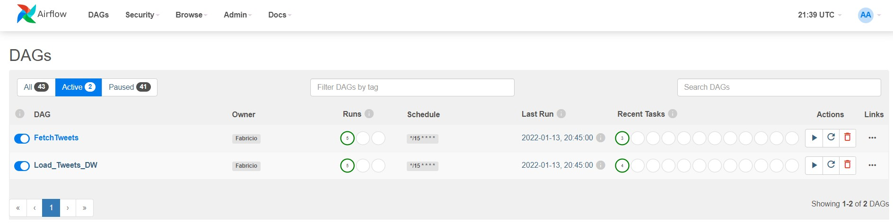
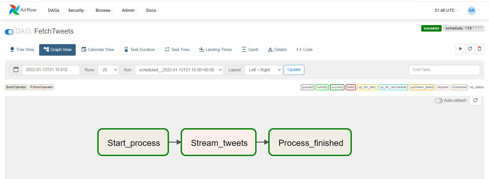
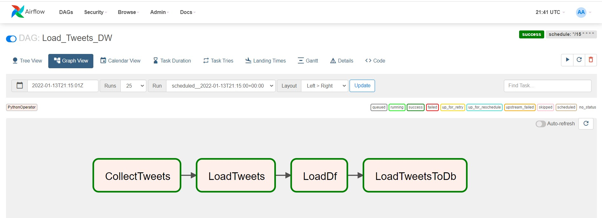
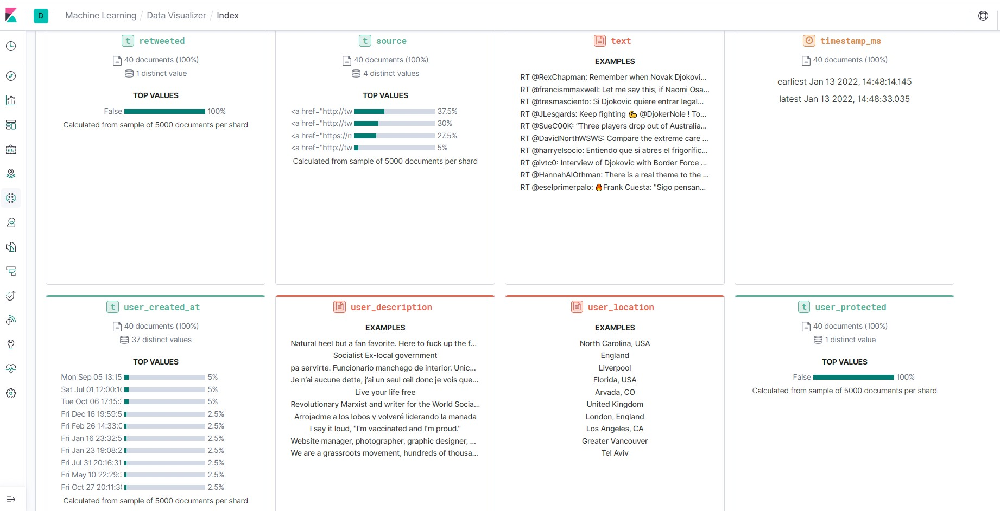

## Fetch Tweets dataengproject

ETL project to fetch tweets, load into datalake (mongodb and txt), then load it in a DW (postgres).

The purpose of this project is to practice the development of a complete data pipeline. We´ll be using Airflow to orchestrate the dag runs, mongodb as a datalake (data swamp at this point) and a Postgres instance as a datawarehowse, where the transformed data is loaded so we can run queries to retreive more meaningful content out of all the "junk" we get from twitter! There´s also a choise of loading the modifed data into Kibana, as a csv file with the same data loaded in the DW was generated with the da "Load_To_Dw".  :)  

To configure and start all this infrastructure at once, I used docker-compose. 

The steps of the project are:

1. Fetch tweets using tweepy library.
2. Store all the tweetes fetched by the "Fetch Tweets" Dag in a mongodb and generate a txt file.
3. Read the txt file and create a dataframe from it.
4. Remove useless colunms.
5. Load transformed data into Postgres and create a csv file of it.
6. Load csv into Kibana to create dashboard.

#### Screenshot of the Airflow Dags view

### The structure of a tweet

""
> db.fetched_tweets.find({"id_str": "1481722565433479172"})
{ "_id" : ObjectId("61e089542dbdf92e6f23c5b9"), "created_at" : "Thu Jan 13 20:19:23 +0000 2022", "id" : NumberLong("1481722565433479172"), "id_str" : "1481722565433479172", "text" : "RT @JulieOwenMoylan: The absolute gobsmacking entitlement of Boris Johnson, Prince Andrew and Novax Djokovic.\n\nRules don’t apply and other…", "source" : "<a href=\"http://twitter.com/download/iphone\" rel=\"nofollow\">Twitter for iPhone</a>", "truncated" : false, "in_reply_to_status_id" : null, "in_reply_to_status_id_str" : null, "in_reply_to_user_id" : null, "in_reply_to_user_id_str" : null, "in_reply_to_screen_name" : null, "user" : { "id" : NumberLong("1346503308765229056"), "id_str" : "1346503308765229056", "name" : "SJ_ 🇪🇺 🏴󠁧󠁢󠁳󠁣󠁴󠁿", "scr        een_name" : "Ms_SJP", "location" : "Brexit Plague Island ", "url" : null, "description" : "Glaswegian European 🏴󠁧󠁢󠁳󠁣󠁴󠁿🇪🇺 #avgeek ✈️Japanophile 🇯🇵, atheist, @uof          Glasgow , EFL teacher, kimchi addict, dog person #wearamask #fucktheTories 🟣🟢", "translator_type"   : "none", "protected" : false, "verified" : false, "followers_count" : 1879, "friends_count" : 3304, "listed_count" : 1, "favourites_count" : 31731, "statuses_count" : 10489, "created_at" : "Tue Jan 05 17:06:36 +0000 2021", "utc_offset" : null, "time_zone" : null, "geo_enabled" : false, "lang" : null, "contributors_enabled" : false, "is_translator" : false, "profile_background_color" : "F5F8FA", "profile_background_image_url" : "", "profile_background_image_url_https" : "", "profile_background_tile" : false, "profile_link_color" : "1DA1F2", "profile_sidebar_border_color" : "C0DEED", "profile_sidebar_fill_color" : "DDEEF6", "profile_text_color" : "333333", "profile_use_background_image" : true, "profile_image_url" : "http://pbs.twimg.com/profile_images/1471413718261055490/hS2LgrF2_normal.jpg", "profile_image_url_https" : "https://pbs.twimg.com/profile_images/1471413718261055490/hS2LgrF2_normal.jpg", "profile_banner_url" : "https://pbs.twimg.com/profile_banners/1346503308765229056/1639285405", "default_profile" : true, "default_profile_image" : false, "following" : null, "follow_request_sent" : null, "notifications" : null, "withheld_in_countries" : [ ] }, "geo" : null, "coordinates" : null, "place" : null, "contributors" : null, "retweeted_status" : { "created_at" : "Thu Jan 13 08:15:41 +0000 2022", "id" : NumberLong("1481540442374164481"), "id_str" : "1481540442374164481", "text" : "The absolute gobsmacking entitlement of Boris Johnson, Prince Andrew and Novax Djokovic.\n\nRules don’t apply and oth… https://t.co/YQjXq4mTRq", "source" : "<a href=\"http://twitter.com/download/iphone\" rel=\"nofollow\">Twitter for iPhone</a>", "truncated" : true, "in_reply_to_status_id" : null, "in_reply_to_status_id_str" : null, "in_reply_to_user_id" : null, "in_reply_to_user_id_str" : null, "in_reply_to_screen_name" : null, "user" : { "id" : NumberLong("707197958333337600"), "id_str" : "707197958333337600", "name" : "Julie Owen Moylan", "screen_name" : "JulieOwenMoylan", "location" : null, "url" : "http://www.JulieOwenMoylan.com", "description" : "Literature Miner. 🏴󠁧󠁢󠁷󠁬󠁳󠁿. THAT GREEN-EYED GIRL @MichaelJBooks May 12 2022. Will write for cake      ...  rep’d by @Nelle_Andrew Publicist @Livvii", "translator_type" : "none", "protected" : false, "verified" : false, "followers_count" : 24801, "friends_count" : 869, "listed_count" : 118, "favourites_count" : 212459, "statuses_count" : 161142, "created_at" : "Tue Mar 08 13:35:07 +0000 2016", "utc_offset" : null, "time_zone" : null, "geo_enabled" : false, "lang" : null, "contributors_enabled" : false, "is_translator" : false, "profile_background_color" : "F5F8FA", "profile_background_image_url" : "", "profile_background_image_url_https" : "", "profile_background_tile" : false, "profile_link_color" : "1DA1F2", "profile_sidebar_border_color" : "C0DEED", "profile_sidebar_fill_color" : "DDEEF6", "profile_text_color" : "333333", "profile_use_background_image" : true, "profile_image_url" : "http://pbs.twimg.com/profile_images/1215724426651717633/c9d3yBMf_normal.jpg", "profile_image_url_https" : "https://pbs.twimg.com/profile_images/1215724426651717633/c9d3yBMf_normal.jpg", "profile_banner_url" : "https://pbs.twimg.com/profile_banners/707197958333337600/1624014128", "default_profile" : true, "default_profile_image" : false, "following" : null, "follow_request_sent" : null, "notifications" : null, "withheld_in_countries" : [ ] }, "geo" : null, "coordinates" : null, "place" : null, "contributors" : null, "is_quote_status" : false, "extended_tweet" : { "full_text" : "The absolute gobsmacking entitlement of Boris Johnson, Prince Andrew and Novax Djokovic.\n\nRules don’t apply and other people don’t matter. \n\n�🤬🤬"", "display_text_range" : [ 0, 144 ], "entities" : { "hashtags" : [ ], "urls" : [ ], "user_mentions" : [ ], "symbols" : [ ] } }, "quote_count" : 6, "reply_count" : 26, "retweet_count" : 122, "favorite_count" : 1034, "entities" : { "hashtags" : [ ], "urls" : [ { "url" : "https://t.co/YQjXq4mTRq", "expanded_url" : "https://twitter.com/i/web/status/1481540442374164481", "display_url" : "twitter.com/i/web/status/1…", "indices" : [ 117, 140 ] } ], "user_mentions" : [ ], "symbols" : [ ] }, "favorited" : false, "retweeted" : false, "filter_level" : "low", "lang" : "en" }, "is_quote_status" : false, "quote_count" : 0, "reply_count" : 0, "retweet_count" : 0, "favorite_count" : 0, "entities" : { "hashtags" : [ ], "urls" : [ ], "user_mentions" : [ { "screen_name" : "JulieOwenMoylan", "name" : "Julie Owen Moylan", "id" : NumberLong("707197958333337600"), "id_str" : "707197958333337600", "indices" : [ 3, 19 ] } ], "symbols" : [ ] }, "favorited" : false, "retweeted" : false, "filter_level" : "low", "lang" : "en", "timestamp_ms" : "1642105163330" }""

### After transformation and load in DW

dataengwarehouse=# select user_screen_name, user_location, text from tweets where user_location not like ' ' order by user_location LIMIT 10;
| user_screen_name | user_location                                               | \|text                                                                                                                                         |
|------------------|-------------------------------------------------------------|------------------------------------------------------------------------------------------------------------------------------------------------|
| Chez11711852     | \| 🇦🇺                                                       | \| RT @gigicat7_: Tennys Sandgren: "If Djokovic is depo                                                                                        |
| mnimnh           | \| 1652 country                                             | \| RT @HannahAlOthman: There is a real theme to the current news: rich, white men thinking laws and rules don’t apply to them. Boris Johnson,… |
| angeldliglesia   | \| A Coruña, España                                         | \| RT @tresmasciento: Si Djokovic quiere entrar legalmente en España que robe un Rolex en Las Ramblas de Barcelona como todos los demás.       |
| Mikail_McFunzy   | \| Alsace, France                                           | \| RT @tridsports: Conférence de presse lunaire de Nadal                                                                                       |
| TrustWebMan      | \| Arvada, CO                                               | \| RT @RexChapman: Remember when Novak Djokovic called out Naomi Osaka for not following the rules?                                            |
| michaelwhee1     | \| Atlanta, GA USA/ BGC PH \| RT @Martina: Not acceptable … |                                                                                                                                                |
| KoolKev512       | \| Austin, TX                                               | \| RT @RexChapman: Remember when Novak Djokovic called out Naomi Osaka for not following the rules?                                            |
| mcmillan_bronte  | \| Australia                                                | \| RT @dootsiez: So Djokovic did not want to “let down” a journalist so he exposed said journalist to a potentially fatal virus instead?       |
| 4Postes          | \| Ávila, España                                            | \| RT @tresmasciento: Si Djokovic quiere entrar legalmente en España que robe un Rolex en Las Ramblas de Barcelona como todos los demás.       |
| Evaldo_Tsadik    | \| Bahia-Brasil                                             | \| RT @lordivan22: Austrália 🇦🇺: O governo australiano                                                                                         |

#### Visualization in Kibana

